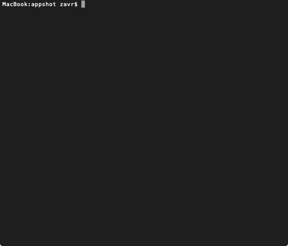

# appshot

[](https://badge.fury.io/js/appshot)
[](https://travis-ci.org/artdecocode/appshot)

```
yarn add global appshot

# or
npm i -g appshot
```

A CLI tool to record gifs of apps on MacOS.

![appshot gif][appshot-appshot.gif]

<p align="center"><a href="#table-of-contents"></a></p>

## Table Of Contents

- [Table Of Contents](#table-of-contents)
- [ImageMagic convert](#imagemagic-convert)
- [CLI](#cli)
  * [`--list`, `-l`](#--list--l)
    * [<code>apphost -l</code>](#apphost--l)
  * [`--app`, `-a`](#--app--a)
  * [`--title`, `-t`](#--title--t)
  * [`--wait`, `-w`](#--wait--w)
  * [`--file`, `-f`](#--file--f)
  * [`--delay`, `-d`](#--delay--d)
  * [`--resize`, `-z`](#--resize--z)
  * [`--colors`, `-c`](#--colors--c)
  * [`--dir`, `-D`](#--dir--d)
  * [`--gifsicle`, `-g`](#--gifsicle--g)
  * [`--max`, `-m`](#--max--m)
  * [`--chopTop`, `-T`: Chop Top](#--choptop--t-chop-top)
- [Copyright](#copyright)

<p align="center"><a href="#table-of-contents"></a></p>

## ImageMagic convert

The `convert` utility from ImageMagic library should be installed to allow saving optimised gifs.

```sh
brew install imagemagic
```

Otherwise, unoptimised records can be taken with `-g` flag.

## CLI

After installing globally, the program can be run. Pass a part of the window title to start recording.

```
appshot part_of_window_title
```

```
appshot README.md
```

If more that one window is found, the recording won't start.

### `--list`, `-l`

Only list the open windows without capturing a gif. Display the window's ID, App, title and PID.

```sh
appshot -l
```
```
┌────────┬──────────────────┬────────────────────────────────────────┬────────┐
│ winid  │ app              │ title                                  │ pid    │
│ 84     │ Flux             │ Item-0                                 │ 912    │
│ 61     │ SystemUIServer   │ AppleClockExtra                        │ 346    │
│ 49     │ SystemUIServer   │ AirPortExtra                           │ 346    │
│ 92     │ Tunnelblick      │ Item-0                                 │ 1058   │
│ 157    │ AAM Updates Not… │ Item-0                                 │ 2771   │
│ 86     │ Evernote Helper  │ Item-0                                 │ 911    │
│ 35     │ SystemUIServer   │ AppleTimeMachineExtra                  │ 346    │
│ 39     │ SystemUIServer   │ AppleBluetoothExtra                    │ 346    │
│ 43     │ SystemUIServer   │ AppleVolumeExtra                       │ 346    │
│ 57     │ SystemUIServer   │ BatteryExtra                           │ 346    │
│ 53     │ SystemUIServer   │ AppleTextInputExtra                    │ 346    │
│ 65     │ SystemUIServer   │ AppleUser                              │ 346    │
│ 30     │ Spotlight        │ Item-0                                 │ 371    │
│ 21     │ SystemUIServer   │ NotificationCenter                     │ 346    │
│ 3      │ Window Server    │ Menubar                                │ 209    │
│ 151    │ Code             │ index.md — appshot                     │ 333    │
│ 71     │ Code             │ index.js — depack                      │ 333    │
│ 99     │ Google Chrome    │                                        │ 337    │
│ 98     │ Google Chrome    │ artdecocode/appshot: Records Gifs Of … │ 337    │
│ 272    │ Terminal         │ appshot — -bash — 79×34                │ 339    │
│ 76     │ Sketch           │ Welcome to Sketch                      │ 340    │
│ 4      │ Window Server    │ Backstop Menubar                       │ 209    │
│ 33     │ Finder           │                                        │ 347    │
│ 14     │ Dock             │ Desktop Picture - DefaultDesktop.heic  │ 345    │
│ 2      │ Window Server    │ Desktop                                │ 209    │
└────────┴──────────────────┴────────────────────────────────────────┴────────┘
```

<details>
  <summary>Click to View: <a name="apphost--l"><code>apphost -l</code></a></summary>
  <table>
  <tr><td>
    
  </td></tr>
  </table>
</details>

### `--app`, `-a`

Filter by the name of the application.

### `--title`, `-t`

Filter by the title of the window. Same as passing the title as the first argument.

### `--wait`, `-w`

Delay in seconds before the recording starts.

### `--file`, `-f`

Path to the file. If none specified, a prompt will be displayed.

### `--delay`, `-d`

How often to take screenshots. Defaults to 1 second.

### `--resize`, `-z`

Resize to this width, keeping height proportionate.

### `--colors`, `-c`

How many colors to use in the output gif.

### `--dir`, `-D`

Directory in which to save the gif.

### `--gifsicle`, `-g`

Save in unoptimised gif format. This can be used when `imagemagic` is not installed, however not recommended as the image size is not optimal.

### `--max`, `-m`

Capture this number of frames at max and stop recording.

### `--chopTop`, `-T`: Chop Top

How many pixels to take off top of each image. Pass `23` value (on non-retina displays) to remove the window headers, which can change title or status and lead to de-optimisation.


## Copyright

(c) [Art Deco][1] 2018

[1]: https://artdeco.bz

<p align="center"><a href="#table-of-contents"></a></p>