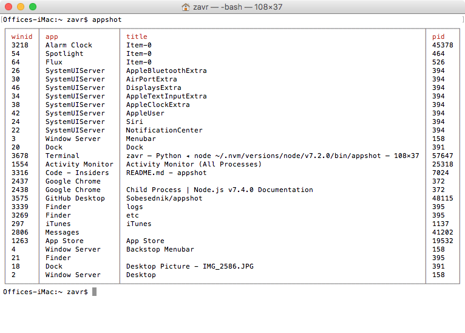
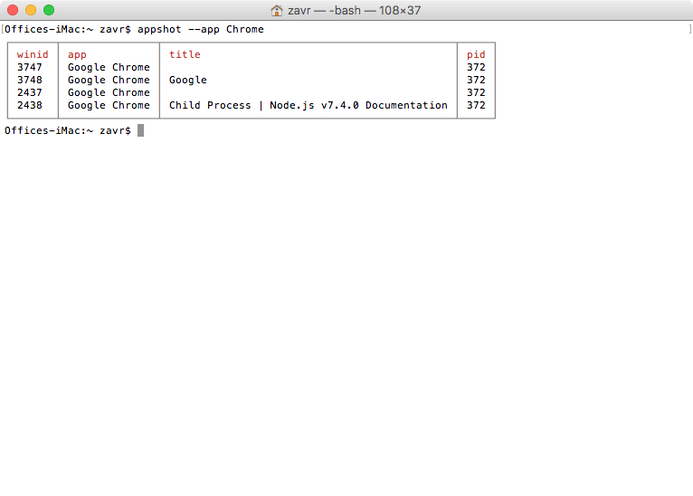
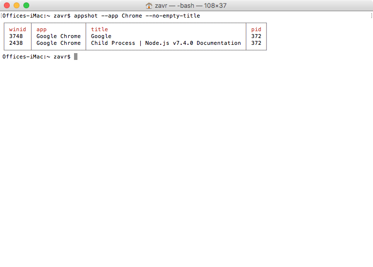
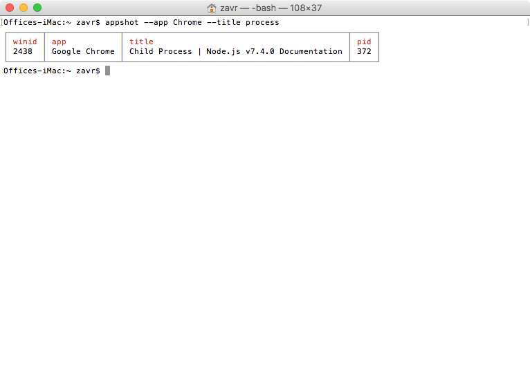
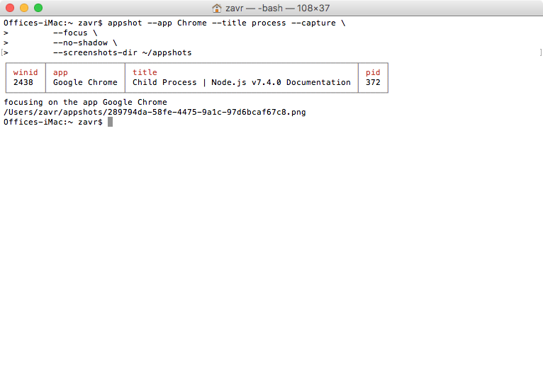

# Browsershot

A tool to list capture application windows on MacOS.

```bash
npm i -g appshot
```

## commands

- `appshot` list all windows



- `apphost --app App` filter by app



- `apphost --no-empty-title` filter out windows with empty title



- `apphost --title Title` filter by title



- `apphost --capture` save screenshot



### capture options

- `--no-shadow` disable shadow
- `--screenshots-dir Directory` where to save screenshots. _default_ = ./screenshots
- `--format jpg` png or jpeg. _default_ png
- `--focus` bring window to focus (with apple script)

## Explaination

Data comes encoded as JSON string from `etc/run.py`, which uses Quartz to
get information about windows.

```
[[64, "Flux", "Item-0", 526], [26, "SystemUIServer", "AppleBluetoothExtra", 394], [30, "SystemUIServer", "AirPortExtra", 394], [46, "SystemUIServer", "DisplaysExtra", 394], [34, "SystemUIServer", "AppleTextInputExtra", 394], [38, "SystemUIServer", "AppleClockExtra", 394], [42, "SystemUIServer", "AppleUser", 394], [54, "Spotlight", "Item-0", 464], [24, "SystemUIServer", "Siri", 394], [22, "SystemUIServer", "NotificationCenter", 394], [3, "Window Server", "Menubar", 158], [20,
"Dock", "Dock", 391], [314, "iTerm2", "1. bash", 1219], [2437, "Google Chrome", "", 372], [2438, "Google Chrome", "Logfile by z-vr \u00b7 Pull Request #1 \u00b7 Sobesednik/browsershot", 372], [297, "iTunes", "iTunes", 1137], [2778, "Finder", "logs", 395], [2510, "Finder", "58dc0ebb-12d3-42d0-8f68-73ebe6821f44", 395], [1554, "Activity Monitor", "Activity Monitor (All Processes)", 25318], [1263, "App Store", "App Store", 19532], [4, "Window Server", "Backstop Menubar", 158], [21,
"Finder", "", 395], [18, "Dock", "Desktop Picture - IMG_2586.JPG", 391], [2, "Window Server", "Desktop", 158]]
```

JSON-encoded array with records like `[winid, app, title, pid]` is printed to `stdout` by Python
and deserialised by Node. Once window id is found, we can call `screecapture -l<winid>` to take
a screenshot of an app.

# TODO:

 - add support for export of all fields from python, and provide interface between python script and nod
